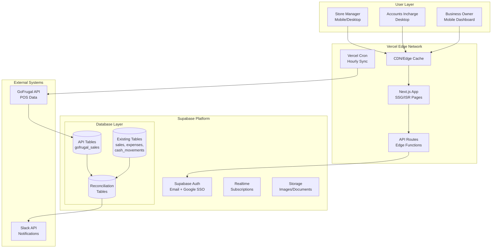

# 2. High Level Architecture

### Technical Summary

The DSR-MVP Dual-Source Retail ERP implements a **Validation Layer Architecture** using a surgical enhancement approach on the existing Next.js/Supabase stack. The system combines real-time GoFrugal API integration for automated sales data with enhanced manual tender-type entry for granular cash control, creating an intelligent three-way reconciliation engine between POS, manual, and bank data. Deployed on Vercel with Supabase backend, the architecture leverages serverless Edge Functions for API synchronization while maintaining application-level security for multi-tenant store isolation. This dual-source approach transforms manual data entry from a limitation into a strategic validation advantage, achieving the PRD's goal of reducing reconciliation time by 75% while maintaining complete audit control.

### Platform and Infrastructure

**Platform:** Vercel + Supabase (Existing)
**Key Services:** Vercel (hosting, cron, edge functions), Supabase (PostgreSQL, Auth, Realtime, Storage), GoFrugal API
**Deployment Host and Regions:** Vercel Global CDN with Supabase in Mumbai region (ap-south-1)

### Repository Structure

**Structure:** Monolithic Next.js application
**Monorepo Tool:** N/A - Single application repository
**Package Organization:** Feature-based organization within app directory using Next.js 15 App Router

### Architecture Diagram

### Architectural Patterns

- **Validation Layer Architecture:** Parallel API integration preserves manual entry as validation checkpoint
- **Surgical Enhancement Pattern:** Add capabilities via parallel structures without modifying existing
- **Service Layer Security Pattern:** Centralized data access services enforce store-level isolation
- **Repository Pattern:** Abstract data access for both manual and API data
- **Circuit Breaker Pattern:** Graceful degradation when GoFrugal API fails
- **Optimistic UI Updates:** Immediate feedback with background synchronization

